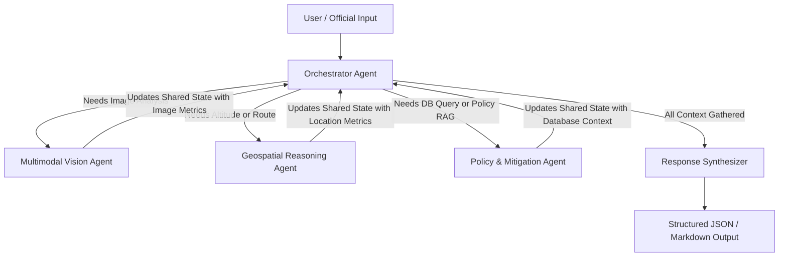

# Product Requirements and Architectural Specification: FloodGuard AI

---

## 1. Executive Summary & Strategic Vision
Modern urban centers, particularly rapidly growing monsoonal cities in the APAC region like Bengaluru, face severe, climate-induced urban flooding. Rapid precipitation events overwhelm municipal drainage infrastructure, paralyzing transportation, causing property damage, and threatening lives. Traditional emergency response is reactive, lacking predictive, localized, and actionable warnings for citizens and officials alike.

**FloodGuard AI** is a predictive, AI-powered Decision Intelligence Platform designed to transition disaster management from reactive response to proactive resilience. By integrating topological data, real-time meteorological forecasts, and community feedback, FloodGuard AI delivers:
- **For Residents**: Conversational guidance, localized flood vulnerability checklists, and safe navigation route recommendations that avoid waterlogged areas.
- **For Officials / Resident Welfare Associations (RWAs)**: A macro-level command center displaying real-time risk heatmaps, active distress alerts, resource distribution, and an AI-powered what-if simulator for pre-flooding mitigation.

---

## 2. Technical Stack & Service Alignment
Based on hackathon constraints and architectural decisions, the platform leverages the following Google Cloud and open-source components:

| Component | Tool / Service | Purpose |
| :--- | :--- | :--- |
| **Orchestration Framework** | **ADK 2.0 (Agent Development Kit)** | Graph-based multi-agent system orchestrating specialized agents (Orchestrator, Geospatial, Policy, Vision). |
| **Core AI / LLM** | **Gemini 3.5 Flash** (Vertex AI) | Language reasoning, vision-based depth estimation, checklist generation. |
| **Data Warehouse & Vector RAG** | **BigQuery + BigQuery Vector Search** | A unified data store housing structured sensor feeds, historical flood logs, and vector embeddings of municipal guidelines (RAG) and community reports. |
| **Backend API** | **FastAPI on Cloud Run** | High-performance, scalable Python API hosting the ADK graph and route calculation services. |
| **Resident UI** | **React SPA (Vite)** | A chat-focused assistant UI designed for mobile and web, returning external, waypoint-guided Google Maps links. Supports multi-user profile switching. |
| **Official UI** | **React SPA (Vite)** | A desktop dashboard incorporating the Google Maps JavaScript API with heatmap layers, resource plotting, and an integrated sidebar chat panel. |
| **Maps Platform** | **Google Maps Platform APIs** | Elevation API (altitudes), Routes API (with Flyover and alternative routes), Maps JS API (for official visualization). |
| **Spatial Analysis** | **Turf.js (or Python Shapely equivalent)** | Decodes route polylines and performs spatial intersection checks against active flood polygons. |

---

## 3. Two-Application Architecture & Interface Design
To avoid code coupling and ensure high performance, the system is split into two distinct React applications.

### 3.1 Resident Application (Mobile & Desktop Web)
Designed for high accessibility under stressful conditions.
- **Demo Profile Switcher**: A header widget allowing judges to select different resident personas (e.g., Rajesh, Radha, or Anonymous) to showcase multi-user synchronization.
- **Conversational Interface**: Chat assistant (powered by the ADK Orchestrator) answering safety queries, maintaining thread history isolated by `session_id`.
- **Dynamic Checklists**: Custom markdown outputs containing step-by-step precautions based on current risk score.
- **Safe Navigation Link**: Requesting routes returns a button redirecting the user to the native Google Maps app via a custom, pre-calculated waypoint URL that forces safe transit.
- **Multimodal Upload**: Button to capture and upload photos of localized waterlogging.

### 3.2 Official / RWA Dashboard (Desktop Split-Screen)
A unified control center for real-time situational awareness and conversational analytics.
- **Left Panel (Interactive Map)**: Built using the **Google Maps JavaScript API** showing:
  - **Heatmap Layer**: Dynamic rendering of the Flood Vulnerability Index (FVI).
  - **Markers**: SOS distress signals (categorized by severity, matching resident uploads), water pumps, and open drains.
  - **Boundaries**: Polygons highlighting active flood zones.
- **Right Panel (Conversational Console)**: A sidebar chat window supporting:
  - **What-If Simulator**: Natural language queries to test interventions (e.g., "What happens if we desilt these 3 drains?").
  - **Multimodal Uploads**: Ability to upload drone imagery or files for site condition analysis.
  - **Report Generator**: Natural language trigger to compile and download post-flood recovery briefs with confidence scores.

---

## 4. Multi-Agent System Design (ADK 2.0 Graph Flow)
The backend utilizes a graph-based state machine (ADK 2.0) with a shared conversation state. Complex queries (e.g., photo uploads + location questions) trigger a cyclic routing loop rather than a single linear path:



### 4.1 Agent Responsibilities (Functional Mapping)
1. **Orchestrator Agent**: Inspects inputs, maintains dialog state across steps, routes execution through the ADK 2.0 graph, and triggers the synthesizer.
2. **Geospatial Reasoning Agent**: Resolves locations, queries altitudes, requests alternative routes, performs Turf.js polygon intersection checks, and formats waypoint navigation links. (Fulfills **Risk Assessment** and **Personalized Guidance** goals).
3. **Policy & Mitigation Agent**: Connects to BigQuery Vector Search for guideline retrieval and BigQuery SQL client to execute simulations and run analytics. (Fulfills **Mitigation Actions** and **Report & Simulator** goals).
4. **Multimodal Vision Agent**: Uses Gemini 3.5 Flash Vision to estimate flood depth, vehicle submersion, and property damage from user uploads, logging results to the shared state.

---

## 5. API Endpoint Architecture
To ensure security, isolated session tracking, and live updates, the backend FastAPI application exposes separate routing controllers:

### 5.1 Resident Endpoints (`/api/resident/...`)
* `POST /api/resident/chat` — Conversational engine. Accepts a payload of `session_id`/`user_id`, current coordinates, and text query.
* `POST /api/resident/upload-sos` — Ingests photo bytes and coordinates, invokes the Vision Agent, and logs an active SOS alert in BigQuery.
* `GET /api/resident/alerts?lat={lat}&lng={lng}` — Returns localized flood alerts or evacuation notices matching the coordinate region.

### 5.2 Official Endpoints (`/api/official/...`)
* `POST /api/official/chat` — Conversational console. Supports administrative policy RAG and simulation triggers.
* `GET /api/official/dashboard-summary` — Retrieves coordinates of active SOS alerts, water depth severity, current status of pumps, and drainage chokes to plot on the map.
* `POST /api/official/simulate` — Runs a mock analytical query to evaluate FVI risk changes after desilting drains or routing water pumps.
* `GET /api/official/export-report` — Compiles and exports post-recovery markdown summaries.
* `GET /api/official/live-sos-feed` — **WebSocket / SSE** endpoint that streams incoming resident SOS alerts (with location, severity, and photo URLs) directly to the maps dashboard in real time.

---

## 6. Core Algorithmic Implementations

### 6.1 Flood Vulnerability Index (FVI)
The FVI ($V$) represents dynamic flood risk calculated on a grid cell basis ($30\text{m} \times 30\text{m}$):
$$V = (w_{elev} \times \Delta E) + (w_{slope} \times S) + (w_{rain} \times R) + (w_{drain} \times D)$$
- $\Delta E$: Relative elevation factor (low point sink vs. surrounding topography).
- $S$: Slope of the terrain (flat terrain = higher stagnation score).
- $R$: Dynamic rainfall intensity ($mm/hr$) retrieved from weather telemetry.
- $D$: Distance to known storm water drain choke points or historical low-lying areas.

*Implementation Note*: BigQuery continuously computes this index across simulated grids. If $V > \text{Threshold}$, the Orchestrator marks the cell as an active flood polygon.

### 6.2 Dynamic Polygon Avoidance & Waypoint Injection
Google Maps' navigation engine automatically recalculates routes to find the fastest path, ignoring drawn polygons. To guarantee turn-by-turn navigation follows a safe route, the system implements **Waypoint Injection**:

1. **Alternatives Query**: Backend calls the Google Maps Routes Preferred API with `computeAlternativeRoutes: true` and requests `FLYOVER_INFO_ON_POLYLINE`.
2. **Polyline Decode**: Returns are decoded into coordinate arrays.
3. **Spatial Intersection**: Turf.js (or Python backend equivalent) performs a line intersection check against active flood polygons stored in BigQuery.
4. **Route Filtering**: Routes traversing flood polygons are discarded. Flyovers are prioritized because they bypass surface-level flooding.
5. **Waypoint Hack**: If all standard routes are blocked, the Geospatial Agent calculates a safe coordinate (outside the polygon) and injects it as an intermediate waypoint, creating a multi-stop URL:
   `https://www.google.com/maps/dir/?api=1&origin={lat,lng}&destination={lat,lng}&waypoints={safe_lat,safe_lng}&travelmode=driving`

---

## 7. Model Context Protocol / Agent Tools Specification
To feed data into ADK 2.0, the backend implements the following tools. Each tool supports a `use_mock` parameter to allow testing weather, elevation, and navigation scenarios.

```python
# Pseudo-schemas for ADK tools

def get_weather_telemetry(latitude: float, longitude: float, use_mock: bool = False, mock_precipitation: float = None) -> dict:
    """Gets current and forecasted rainfall metrics. Supports manual precipitation injection for mock scenarios."""
    pass

def get_elevation_profile(latitude: float, longitude: float, use_mock: bool = False, mock_altitude: float = None) -> dict:
    """Gets high-resolution altitude and terrain slope parameters."""
    pass

def get_historical_floods(latitude: float, longitude: float) -> list:
    """Queries BigQuery Vector Search for matching coordinates to extract past flood reports and incidents."""
    pass

def calculate_safe_route(origin: str, destination: str, travel_mode: str = "driving", use_mock: bool = False) -> dict:
    """Calculates route alternatives, intersects polylines against active flood zones, and yields safe waypoints."""
    pass

def analyze_flood_image(image_bytes: bytes) -> dict:
    """Sends image bytes to Gemini Vision to assess flood levels, vehicle submersion, and risk level."""
    pass

def run_what_if_simulation(intervention_type: str, details: dict) -> dict:
    """Models municipal interventions (drains, pumps) and returns risk reduction stats from BigQuery ML models."""
    pass
```

---

## 8. 4-Day Development Schedule

* **Day 1: Database & Telemetry Setup**
  * Provision Google Cloud Project & active APIs.
  * Setup BigQuery dataset, load BBMP low-lying KML data, and configure BigQuery Vector Search indexes.
  * Build the Open-Meteo precipitation parser (with demo sliders for mock rainfall).

* **Day 2: Backend Routing & ADK Graph**
  * Implement the ADK 2.0 graph logic in FastAPI (Orchestrator -> Geospatial/Policy/Vision).
  * Write the polyline decoding and Turf.js intersection avoidance routing service.
  * Connect Gemini 3.5 Flash for checklist generation and image-based water depth analysis.

* **Day 3: Dual Frontend Development**
  * **Resident App**: Build the chat UI, image uploader, and Google Maps waypoint redirect buttons.
  * **Official App**: Implement the dashboard with Google Maps JS API (HeatmapLayer, custom markers, and active flood zone polygons).
  * Connect both apps to the FastAPI backend.

* **Day 4: Integration, Testing & Presentation**
  * Run end-to-end trials using the Rajesh & Radha narrative workflow.
  * Perform latency optimization (limiting fields via field masks).
  * Deploy microservices to Cloud Run.
  * Capture demo video.
